** Falta descripcion como importa los comandos bla bla y etc 

### Inserción

**Insertar un nuevo producto llamado "Chocolatina de borojó", categoría "Snack", con precio 4000, stock 35, y tags ["dulce", "energía"].**  
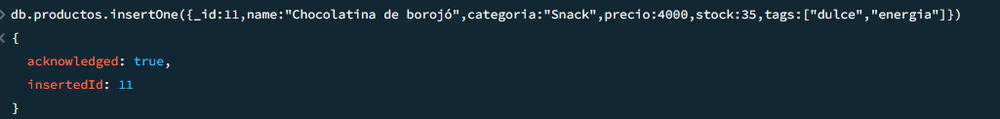

se hace la insercion del documento y tambien del array con los tags solicitados

**Insertar un nuevo cliente que se llama "Mario Mendoza", con correo "mario@email.com", sin compras, y preferencias "energético" y "natural".**
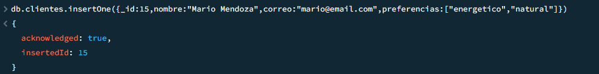
lo mismo del primero insercion del documento y array con las preferencias solicitadas

### Lectura

**Consultar todos los productos que tengan stock mayor a 20 unidades.**
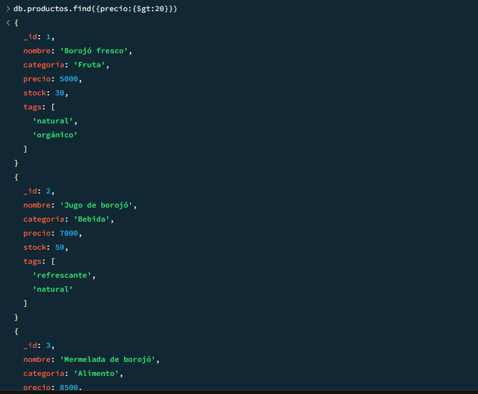
listo hace la consulta y muestra multiples resultados con stock mayor a 20

**Encontrar los clientes que no han comprado aún ningún producto.**
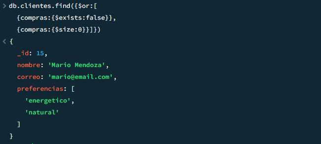
basicamente con un compras:0 hubiera sido suficiente ya que dice que no haya comprado ningun producto pero considerando que no daba ningun resultado ya  que el unico que no ha hecho compras es el que inserte asi que busque que no tuviera compras y que si lo tenia y no tenia nada tambien cuenta 

### Lectura

**Aumentar en 10 unidades el stock del producto "Borojó deshidratado".**
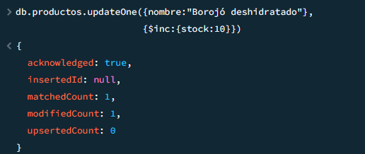
aumente en 10 el stock solicitado haciendo la busqueda del producto por el nombre y con usando $inc

**Añadir el tag "bajo azúcar" a todos los productos de la categoría "Bebida".**
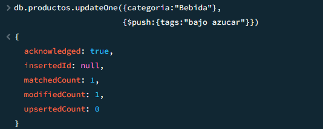
le añado el tag solicitado haciendole push al array 

### Eliminación

**Eliminar el cliente que tenga el correo "juan@email.com".**
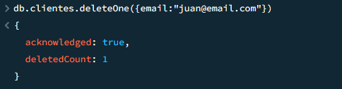
elimino solamente el cliente con el email solicitado

**Eliminar todos los productos con stock menor a 5 (considera esto como un proceso de limpieza de inventario).**
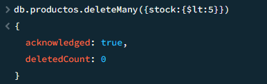
hago la consulta correcta y le digo que elimine todos los que tengas stock menor de 5 y no borra nada porque no hay ninguno en la coleccion dada inicialmente

### Consultas con Expresiones Regulares

**Buscar productos cuyo nombre empiece por "Boro".**

hago la consulta usando regex para expresiones regulares 

**Encontrar productos cuyo nombre contenga la palabra "con" (como en “Concentrado de borojó”).**
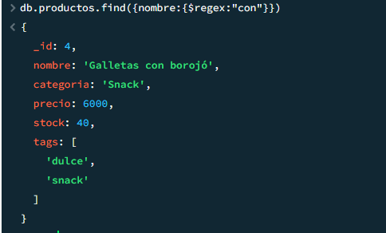
ya hice la busqueda que en cualquier parte del nombre contega la palabra solicitada "con"

**Encontrar clientes cuyo nombre tenga la letra "z" (insensible a mayúsculas/minúsculas).**
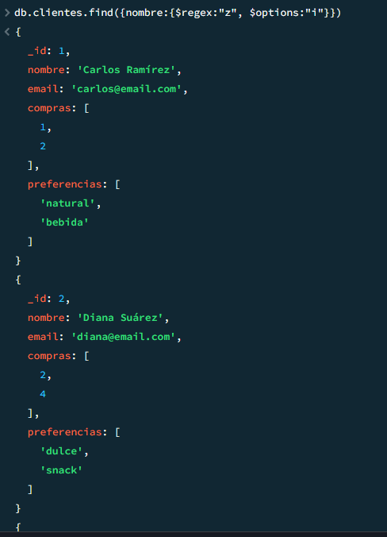
uso lo mismo y $options"i" para que me busque mayusculas y minusculas 

### Operadores en consultas sobre arrays

**Buscar clientes que tengan "natural" en sus preferencias.**
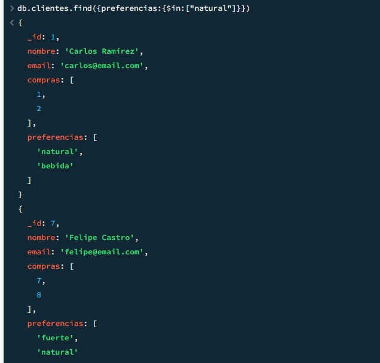
lo hice con in para ser especifico en array pero pude haberlo hecho simplemente con perefencias:"natural"

**Encontrar productos que tengan al menos los tags "natural" y "orgánico" (usa $all).**
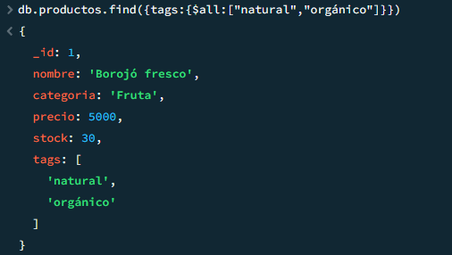
cumplo con lo que me solicito y se usa all

**Listar productos que tienen más de un tag ($size).**
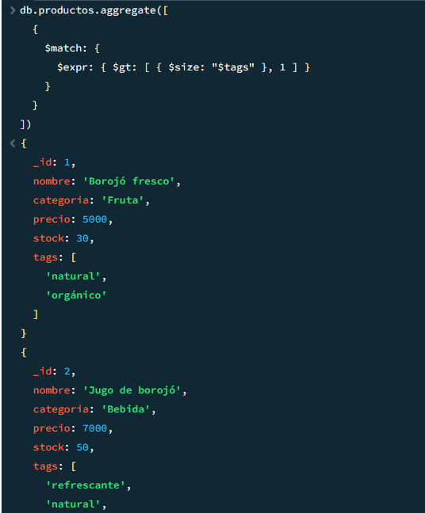
tuve que usar agregate ya que nativamente no se puede conbinar size y gt juntos por lo que use expre para operaciones aritmeticas y de comparacion y que me permitiera jugar con el tamaño del array con find no se puede y con gt y al final del array pasar el uno para que entienda que en $size"tags" deben haber mas de uno ya que size nativamente en find es para buscar si ese array tiene exactamente esa cantidad de elementos pasados

### Aggregation Framework con Pipelines

**Mostrar un listado de los productos más vendidos (suma total de unidades vendidas por producto).**
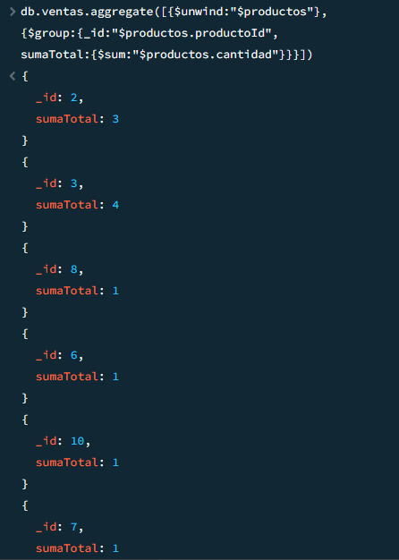
este fue diferente en que tuve que usar $unwind para descomponer el array en documentos individuales ya que productos al ser un array de objetos no me dejo acceder directamente de forma correcta al poner el nombre del array y . para acceder al valor que necesitaba 

**Agrupar clientes por cantidad de compras realizadas.**

use grou para agrupar por clientes y para ver sus compras por cliente use unwind para desestructurar el array y poder sumar sus compras que estaban dentro del array compras

**Mostrar el total de ventas por mes (usa $group y $month).**
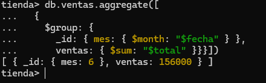
agrupe por mes y usando month que solo recibe formatos tipo fecha lo pase al mes correspondiente y ya que todas las ventas son del mes 6 se muestra solamente el mes 6

**Calcular el promedio de precios por categoría de producto.**
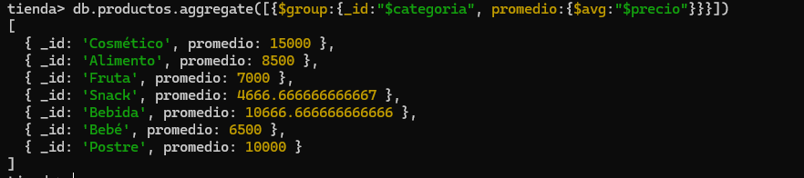
promedio calculado por categoria y usando aggregate del pipeline

**Mostrar los 3 productos con mayor stock (orden descendente con $sort y $limit).**
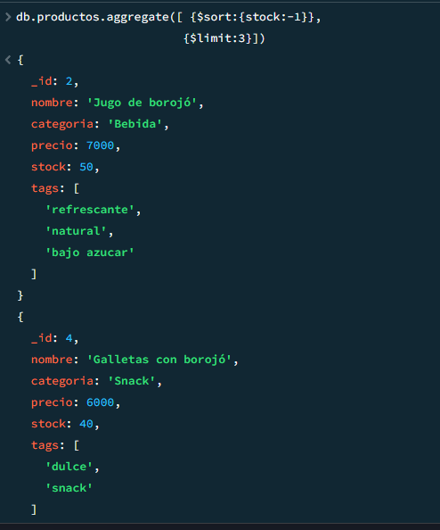
organiza y muestra solo los tres primeros con mas stock

### Funciones definidas en system.js

**Definir una función calcularDescuento(precio, porcentaje) que devuelva el precio con descuento aplicado.**
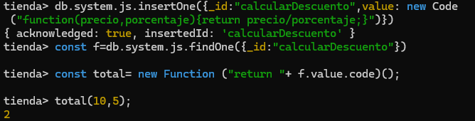
se cumple con lo requerido en la funcion

**Definir una función clienteActivo(idCliente) que devuelva true si el cliente tiene más de 3 compras registradas.**

listo tuve que hacer la funcion sin guardarla sino declarandola directamente con logica de javascripta ya que si la guardaba usando los pasos dados en la clase Esto hace que db.clientes.findOne() falle silenciosamente (devuelve undefined), lo que lleva a que tu función siempre retorne false y no funcione entonces tuve que declararla directamente y ejecutarla sin guardar y sin usar aggregate ya que no es dejavascript sino de mongo para que me funcionara lo que hace es que si el array compras tiene solamente dos datos o menos de cualquier tipo, osea dos compras o menos da false y si tiene tres compras o mas da true 
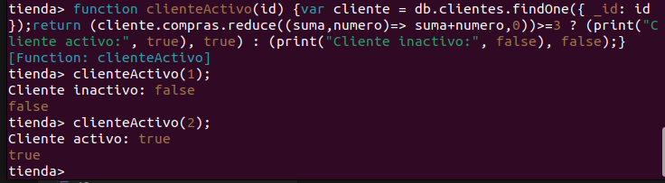

esta pasa lo mismo que explique en el primer caso pero la modifi que para que en vez de cuantos datos tiene el array si es mayor que tres, sume los datos del array usanodo reduce nativo de javascript y si la suma es mayor que tres me de true para este ejemplo modifique el _id:1 ya que ningun documento la suma da menos de tres en todos los casos la suma es mayor de tres.

**Definir una función verificarStock(productoId, cantidadDeseada) que retorne si hay suficiente stock.**
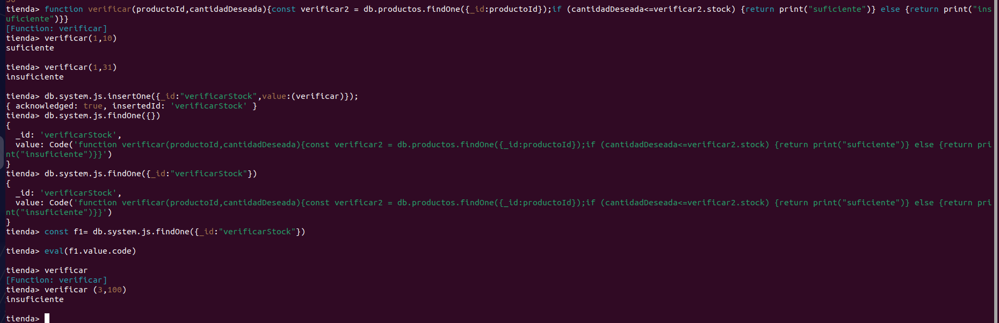
listo primero creo la funcion para evitar errores y ver si funciona y despues la guardo lo cual lo hace normalemente es lo mismo pero alrevez 

### Transacciones

**1. Simular una venta: a. Descontar del stock del producto b. Insertar la venta en la colección `ventas`Todo dentro de una transacción.**

