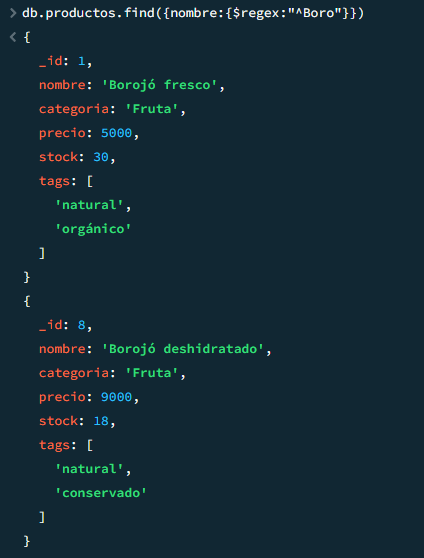
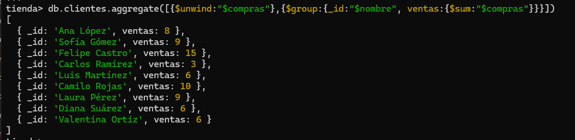

** Falta descripcion como importa los comandos bla bla y etc 

### Inserción

**Insertar un nuevo producto llamado "Chocolatina de borojó", categoría "Snack", con precio 4000, stock 35, y tags ["dulce", "energía"].**  

se hace la insercion del documento y tambien del array con los tags solicitados

**Insertar un nuevo cliente que se llama "Mario Mendoza", con correo "mario@email.com", sin compras, y preferencias "energético" y "natural".**

lo mismo del primero insercion del documento y array con las preferencias solicitadas

### Lectura

**Consultar todos los productos que tengan stock mayor a 20 unidades.**

listo hace la consulta y muestra multiples resultados con stock mayor a 20

**Encontrar los clientes que no han comprado aún ningún producto.**

basicamente con un compras:0 hubiera sido suficiente ya que dice que no haya comprado ningun producto pero considerando que no daba ningun resultado ya  que el unico que no ha hecho compras es el que inserte asi que busque que no tuviera compras y que si lo tenia y no tenia nada tambien cuenta 

### Lectura

**Aumentar en 10 unidades el stock del producto "Borojó deshidratado".**

aumente en 10 el stock solicitado haciendo la busqueda del producto por el nombre y con usando $inc

**Añadir el tag "bajo azúcar" a todos los productos de la categoría "Bebida".**

le añado el tag solicitado haciendole push al array 

### Eliminación

**Eliminar el cliente que tenga el correo "juan@email.com".**

elimino solamente el cliente con el email solicitado

**Eliminar todos los productos con stock menor a 5 (considera esto como un proceso de limpieza de inventario).**

hago la consulta correcta y le digo que elimine todos los que tengas stock menor de 5 y no borra nada porque no hay ninguno en la coleccion dada inicialmente

### Consultas con Expresiones Regulares

**Buscar productos cuyo nombre empiece por "Boro".**

hago la consulta usando regex para expresiones regulares 

**Encontrar productos cuyo nombre contenga la palabra "con" (como en “Concentrado de borojó”).**

ya hice la busqueda que en cualquier parte del nombre contega la palabra solicitada "con"

**Encontrar clientes cuyo nombre tenga la letra "z" (insensible a mayúsculas/minúsculas).**

uso lo mismo y $options"i" para que me busque mayusculas y minusculas 

### Operadores en consultas sobre arrays

**Buscar clientes que tengan "natural" en sus preferencias.**

lo hice con in para ser especifico en array pero pude haberlo hecho simplemente con perefencias:"natural"

**Encontrar productos que tengan al menos los tags "natural" y "orgánico" (usa $all).**

cumplo con lo que me solicito y se usa all

**Listar productos que tienen más de un tag ($size).**

tuve que usar agregate ya que nativamente no se puede conbinar size y gt juntos por lo que use expre para operaciones aritmeticas y de comparacion y que me permitiera jugar con el tamaño del array con find no se puede y con gt y al final del array pasar el uno para que entienda que en $size"tags" deben haber mas de uno ya que size nativamente en find es para buscar si ese array tiene exactamente esa cantidad de elementos pasados

### Aggregation Framework con Pipelines

**Mostrar un listado de los productos más vendidos (suma total de unidades vendidas por producto).**

este fue diferente en que tuve que usar $unwind para descomponer el array en documentos individuales ya que productos al ser un array de objetos no me dejo acceder directamente de forma correcta al poner el nombre del array y . para acceder al valor que necesitaba 

**Agrupar clientes por cantidad de compras realizadas.**

